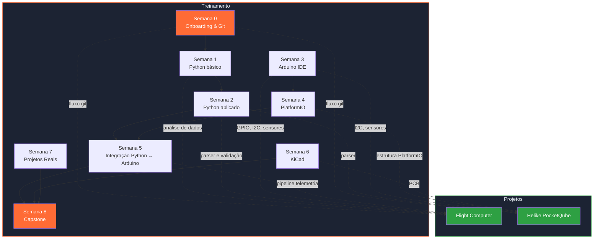

## Conexão das semanas

| Semana | Habilidades | Projeto real |
|---|---|---|
| 0 | Git, GitHub, PRs | Fluxo de desenvolvimento de ambos |
| 1 | Python: CSV, estatísticas | Análise pós-voo do FC |
| 2 | Python: parser, validação | Parsing de telemetria do Helike |
| 3 | Arduino: GPIO, I2C, serial | Testes de hardware de ambos |
| 4 | PlatformIO: estrutura, testes | Organização do firmware Helike |
| 5 | Integração Arduino ↔ Python | Pipeline de telemetria do FC |
| 6 | KiCad: esquemático, ERC | CDB do Helike |
| 7 | Arquitetura de sistemas | Visão geral de ambos |
| 8 | Pipeline completo | Síntese de tudo |
