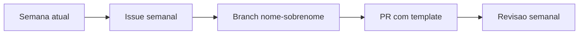

# Guia do Aluno

Este guia explica o fluxo do treinamento e o que se espera de cada entrega.

## Como funciona

1. Leia a **semana atual**
2. Consulte a **issue semanal** correspondente
3. Desenvolva na branch `nome-sobrenome`
4. Abra PR usando o template
5. Participe da revisao semanal

## O que você deve entregar

- Código funcional
- README com instruções
- Evidências (logs/prints simples)

## Onde encontrar tudo

- Roadmap: [roadmap-8-semanas](roadmap-8-semanas.md)
- Semanas: [Semanas do Treinamento](semanas/README.md)
- Issues semanais: [Issues Semanais (Exemplos)](issues-semanais/README.md)
- Trilhas: [Trilhas de Conteudo](trilhas/README.md)
- Exemplos: [Exemplos Minimos](examples/README.md)

## Dicas

- Foque no essencial
- Documente o mínimo para reprodução
- Pergunte cedo se travar
