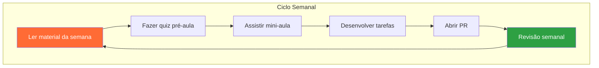

# Guia do Aluno

Este guia explica o fluxo do treinamento e o que se espera de cada entrega.

## Como funciona

1. Leia a **semana atual**
2. Consulte a **issue semanal** correspondente
3. Desenvolva na branch `nome-sobrenome`
4. Abra PR usando o template
5. Participe da revisao semanal

```mermaid
flowchart LR
A[Semana atual] --> B[Issue semanal]
B --> C[Branch nome-sobrenome]
C --> D[PR com template]
D --> E[Revisao semanal]
```

## Fluxo do Treinamento

```mermaid
flowchart TD
    subgraph "Ciclo Semanal"
        A[Ler material da semana] --> B[Fazer quiz pré-aula]
        B --> C[Assistir mini-aula]
        C --> D[Desenvolver tarefas]
        D --> E[Abrir PR]
        E --> F[Revisão semanal]
    end
    
    F --> A
    
    style A fill:#ff6b35,color:#fff
    style F fill:#2ea043,color:#fff
```

## Progressão das Semanas

```mermaid
graph LR
    S0[S0: Setup] --> S1[S1: Python básico]
    S1 --> S2[S2: Python aplicado]
    S2 --> S3[S3: Arduino]
    S3 --> S4[S4: PlatformIO]
    S4 --> S5[S5: Integração]
    S5 --> S6[S6: KiCad]
    S6 --> S7[S7: Projetos reais]
    S7 --> S8[S8: Capstone]
    
    style S0 fill:#8b949e,color:#fff
    style S8 fill:#ff6b35,color:#fff
```

## O que você deve entregar

- Código funcional
- README com instruções
- Evidências (logs/prints simples)

## Onde encontrar tudo

- Roadmap: [roadmap-8-semanas](roadmap-8-semanas.md)
- Semanas: [Semanas do Treinamento](semanas/README.md)
- Issues semanais: [Issues Semanais (Exemplos)](issues-semanais/README.md)
- Trilhas: [Trilhas de Conteudo](trilhas/README.md)
- Exemplos: [Exemplos Minimos](examples/README.md)
- **Exemplos Visuais**: [Guia Visual](exemplos-visuais.md)

## Dicas

- Foque no essencial
- Documente o mínimo para reprodução
- Pergunte cedo se travar

## 💻 Nota sobre o sistema operacional

Todo o treinamento foi desenvolvido e testado em **Linux**. Os comandos, paths (`/dev/ttyACM0`, `~/.bashrc`) e instruções de permissão refletem esse ambiente.

Se você usa **Windows**, algumas adaptações são necessárias:
- **Porta serial**: `COM3`, `COM4` etc. (em vez de `/dev/ttyACM0`)
- **Git**: use Git Bash ou WSL para comandos no terminal
- **Python**: certifique-se de que `python` (ou `py`) está no PATH
- **PlatformIO**: funciona normalmente via VSCode. A porta de upload é detectada automaticamente
- **Drivers**: ESP32-C3 pode precisar de driver CP2102 ou CH340 no Windows

Quando encontrar algo que não funciona igual, pesquise `"<comando> windows"` ou pergunte na issue da semana.
