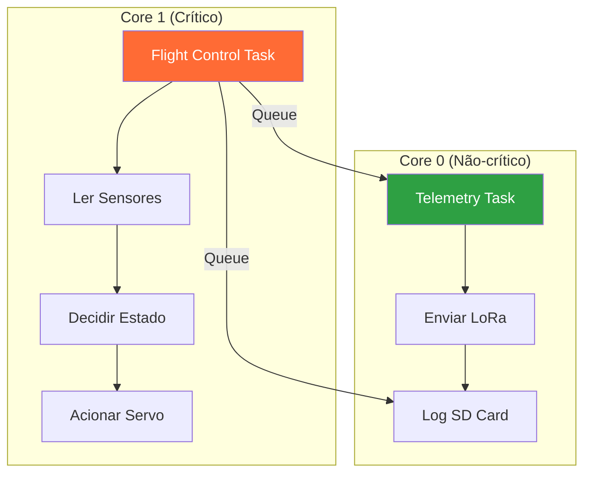
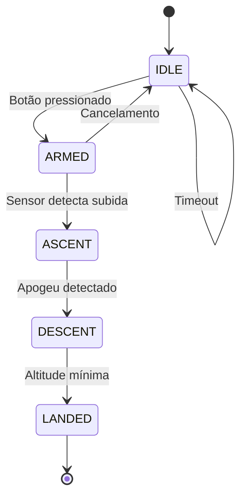

# Trilha Arquitetura de Firmware

Esta trilha cobre os padrões de arquitetura usados nos projetos reais da Serra Rocketry: FreeRTOS para tarefas em tempo real e máquinas de estado para lógica de voo.

## O que você vai aprender

- Conceitos de sistemas em tempo real
- FreeRTOS (tasks, queues, priorities)
- Máquinas de estado finitos (FSM)
- Padrões OOP em firmware embarcado
- Estratégias de comunicação entre tarefas

## Pré-requisitos

- Trilha Arduino IDE concluída
- Conceitos básicos de C++ (classes, herança, polimorfismo)

## Arquitetura FreeRTOS



## Máquina de Estados (FSM)



---

## 1. Sistemas Embarcados em Tempo Real

### 1.1 O que é um sistema real-time?

Um sistema em tempo real não é necessariamente "rápido" - ele precisa responder dentro de prazos determinados. No contexto de foguetes e satélites:

- Flight Computer: precisa ler sensores e tomar decisões em 20ms (50 Hz)
- Helike: precisa transmitir telemetria a cada 200ms (5 Hz)

### 1.2 Criticalidade

| Nível | Exemplo | Consequência de falha |
|-------|---------|----------------------|
| Hard | Detecção de apogeu | Paraquedas não abre → destruição |
| Soft | Telemetria LoRa | Dados perdidos →missão comprometida |
| Non-critical | LED heartbeat | Inconveniência → sem impacto |

---

## 2. FreeRTOS - Multi-tasking no ESP32

### 2.1 Conceitos básicos

FreeRTOS é um sistema operacional de tempo real que permite executar múltiplas "tarefas" (threads) em paralelo. No ESP32-S3 (dual-core), tarefas podem rodar em cores diferentes.

Elementos fundamentais:

- Task: Thread independente com seu próprio stack
- Queue: Canal de comunicação entre tasks (FIFO)
- Priority: Nível de prioridade (maior número = maior prioridade)
- Semaphore/Mutex: Controle de acesso a recursos compartilhados

### 2.2 Arquitetura do Flight Computer

O Flight Computer usa 3 tasks principais:

```cpp
// FlightComputer.ino
void setup() {
    Serial.begin(115200);
    
    // Criar queues
    sensorDataQueue = xQueueCreate(25, sizeof(SensorData));
    logQueue = xQueueCreate(50, sizeof(LogMessage));
    
    // Criar tasks
    xTaskCreatePinnedToCore(
        taskFlightControl,    // Nome da função
        "FlightControl",      // Nome para debug
        4096,                 // Tamanho do stack (bytes)
        NULL,                 // Parâmetro
        20,                   // Prioridade (alta)
        NULL,                 // Task handle
        1                     // Core 1 (crítico)
    );
    
    xTaskCreatePinnedToCore(
        taskTelemetry,
        "Telemetry",
        4096,
        NULL,
        5,                    // Prioridade média
        NULL,
        0                     // Core 0 (não-crítico)
    );
    
    xTaskCreatePinnedToCore(
        taskLogger,
        "Logger",
        2048,
        NULL,
        1,                    // Prioridade baixa
        NULL,
        0                     // Core 0
    );
    
    // Remover loop() - FreeRTOS assume o controle
    vTaskDelete(NULL);
}
```

### 2.3 Tarefa FlightControl (Core 1, 50 Hz)

Esta é a task mais crítica - lê sensores, atualiza FSM e aciona o paraquedas:

```cpp
void taskFlightControl(void *pvParameters) {
    TickType_t xLastWakeTime = xTaskGetTickCount();
    const TickType_t xFrequency = pdMS_TO_TICKS(20); // 20ms = 50Hz
    
    while (true) {
        // 1. Ler sensores
        SensorData data;
        data.altitude = bmp.readAltitude(1013.25);
        data.temperature = bmp.readTemperature();
        data.ax = lsm.readFloatAccelX();
        data.ay = lsm.readFloatAccelY();
        data.az = lsm.readFloatAccelZ();
        data.vz = verticalVelocity.update(data.altitude, millis());
        data.timestamp = millis();
        
        // 2. Atualizar FSM
        FlightState new_state = fsm.update(data);
        
        // 3. Verificar se deve deploy paraquedas
        if (new_state == DESCENT && fsm.shouldDeployParachute()) {
            deployParachute();
        }
        
        // 4. Enviar dados para queue
        xQueueSend(sensorDataQueue, &data, 0);
        
        // 5. Alimentar watchdog
        esp_task_wdt_reset();
        
        // Esperar próximo ciclo
        vTaskDelayUntil(&xLastWakeTime, xFrequency);
    }
}
```

### 2.4 Tarefa Telemetry (Core 0, 5 Hz)

```cpp
void taskTelemetry(void *pvParameters) {
    TickType_t xLastWakeTime = xTaskGetTickCount();
    const TickType_t xFrequency = pdMS_TO_TICKS(200); // 200ms = 5Hz
    
    SensorData latestData;
    
    while (true) {
        // Pegar dados mais recentes da queue
        if (xQueueReceive(sensorDataQueue, &latestData, 0) == pdTRUE) {
            // Enriquecer com GPS
            if (gps.location.isValid()) {
                latestData.lat = gps.location.lat();
                latestData.lon = gps.location.lng();
                latestData.gps_alt = gps.altitude.meters();
                latestData.satellites = gps.satellites.value();
            }
            
            // Montar pacote CSV (22 campos)
            String packet = assembleCSV(latestData);
            
            // Transmitir (Serial + LoRa + SD)
            Serial.println(packet);
            sendLoRa(packet);
            appendFile("/telemetry.csv", packet);
        }
        
        vTaskDelayUntil(&xLastWakeTime, xFrequency);
    }
}
```

### 2.5 Comunicação entre Tasks (Queues)

```cpp
// Definição das queues (global)
QueueHandle_t sensorDataQueue;
QueueHandle_t logQueue;

// Enviando dados (FlightControl → Telemetry)
SensorData data;
data.altitude = 100.5;
xQueueSend(sensorDataQueue, &data, 0); // 0 = não bloquear

// Recebendo dados (Telemetry)
SensorData received;
if (xQueueReceive(sensorDataQueue, &received, 0) == pdTRUE) {
    // Usar received.altitude
}
```

---

## 3. Máquina de Estados Finitos (FSM)

### 3.1 Conceitos

Uma FSM define estados e transições entre eles. No Flight Computer:

```
IDLE → ASCENT → DESCENT → LANDED
```

Cada estado tem regras específicas de comportamento.

### 3.2 Implementação no Flight Computer

```cpp
enum class FlightState {
    IDLE,
    ASCENT,
    DESCENT,
    LANDED
};

class FlightStateMachine {
public:
    FlightState update(const SensorData& data) {
        switch (m_state) {
            case FlightState::IDLE:
                // Transição: liftoff detectado (aceleração > threshold)
                if (data.az > LIFTOFF_THRESHOLD) {
                    m_state = FlightState::ASCENT;
                    m_liftoff_time = data.timestamp;
                }
                break;
                
            case FlightState::ASCENT:
                // Transição: burnout detectado (aceleração cai)
                if (!m_burnout_detected && data.az < BURNOUT_THRESHOLD) {
                    m_burnout_detected = true;
                }
                
                // Transição: apogeu (Vz cruza zero para negativo)
                if (data.vz < -APOGEE_THRESHOLD) {
                    m_state = FlightState::DESCENT;
                    m_apogee_time = data.timestamp;
                    m_apogee_altitude = data.altitude;
                }
                break;
                
            case FlightState::DESCENT:
                // Transição: pousou (altitude estável por N ciclos)
                if (abs(data.vz) < LAND_THRESHOLD && 
                    data.altitude < LAND_ALT_THRESHOLD) {
                    m_land_count++;
                    if (m_land_count >= 10) {
                        m_state = FlightState::LANDED;
                        m_landed_time = data.timestamp;
                    }
                } else {
                    m_land_count = 0;
                }
                break;
                
            case FlightState::LANDED:
                // Estado final - não transiciona
                break;
        }
        
        return m_state;
    }
    
    bool shouldDeployParachute() {
        // Deploy no apogeu com confirmação de Vz negativa
        return m_state == FlightState::DESCENT && 
               !m_parachute_deployed &&
               m_vz_negative_count >= CONFIRM_CYCLES;
    }
    
private:
    FlightState m_state = FlightState::IDLE;
    bool m_liftoff_detected = false;
    bool m_burnout_detected = false;
    bool m_parachute_deployed = false;
    int m_land_count = 0;
    int m_vz_negative_count = 0;
    
    unsigned long m_liftoff_time = 0;
    unsigned long m_apogee_time = 0;
    unsigned long m_landed_time = 0;
    float m_apogee_altitude = 0;
};
```

### 3.3 Sub-event Flags

Além dos estados principais, o Flight Computer rastreia eventos diagnósticos:

```cpp
struct FlightEvents {
    bool liftoff = false;
    bool burnout = false;
    bool apogee = false;
    bool freefall = false;
    bool parachute = false;
    
    void reset() {
        liftoff = burnout = apogee = freefall = parachute = false;
    }
};
```

---

## 4. Padrões OOP em Firmware

### 4.1 Interface Abstrata para Sensores

O padrão ISensor permite trocar sensores sem modificar o código principal:

```cpp
// ISensor.h - Interface abstrata
class ISensor {
public:
    virtual ~ISensor() = default;
    virtual bool begin() = 0;
    virtual bool update() = 0;
    virtual bool isReady() = 0;
    virtual SensorData getData() = 0;
};

// BMP585Sensor.h - Implementação concreta
class BMP585Sensor : public ISensor {
public:
    bool begin() override {
        return m_bmp.begin(BMP585_I2C_ADDRESS);
    }
    
    bool update() override {
        m_data.altitude = m_bmp.readAltitude(1013.25);
        m_data.pressure = m_bmp.readPressure() / 100.0F;
        m_data.temperature = m_bmp.readTemperature();
        return true;
    }
    
    bool isReady() override { return m_initialized; }
    
    SensorData getData() override { return m_data; }
    
private:
    Adafruit_BMP585 m_bmp;
    SensorData m_data;
    bool m_initialized = false;
};
```

### 4.2 Uso polimórfico

```cpp
// Código genérico funciona com qualquer sensor
void readSensors(ISensor* sensors[], int count) {
    for (int i = 0; i < count; i++) {
        if (sensors[i]->isReady()) {
            sensors[i]->update();
            SensorData data = sensors[i]->getData();
            // Processar dados...
        }
    }
}
```

---

## 5. Exercícios práticos

### Nível 1 - FSM básica

1. Implemente uma FSM com 3 estados: `OFF`, `ON`, `BLINK`
2. Transições: botão liga/desliga
3. No estado `BLINK`, o LED pisca a 2 Hz

### Nível 2 - FreeRTOS simples

1. Crie 2 tasks: uma pisca LED, outra envia dados pela serial
2. Use uma queue para enviar dados entre tasks
3. Configure prioridades diferentes

### Nível 3 - Integração completa

1. Implemente uma FSM de voo simplificada (IDLE → ASCENT → DESCENT)
2. Use uma task para ler sensor e atualizar FSM
3. Use outra task para transmitir dados
4. Comunique via queue

### Nível 4 - Projeto real

1. Estude a FSM do Flight Computer em `firmware/flight/FlightStateMachine.h`
2. Analise as tasks em `FlightControlTask.h` e `TelemetryTask.h`
3. Identifique as queues e seu uso
4. Documente o fluxo de dados em um diagrama

---

## Conexão com os projetos reais

| Conceito | Projeto | Onde é usado |
|---|---|---|
| FreeRTOS tasks | Flight Computer | 3 tasks em 2 cores |
| Queues | Flight Computer | sensorDataQueue, logQueue |
| FSM 4 estados | Flight Computer | IDLE → ASCENT → DESCENT → LANDED |
| ISensor interface | Ambos | Abstração de sensores |
| Sub-event flags | Flight Computer | liftoff, burnout, apogee, parachute |
| Priority scheduling | Flight Computer | FlightControl=20, Telemetry=5 |

## Entregas relacionadas

- Semana 7: Arquitetura dos projetos reais
- Semana 8: Pipeline end-to-end (FreeRTOS não é obrigatório no capstone)

## Referências

- [FreeRTOS Documentation](https://www.freertos.org/media/2025/FreeRTOS_Reference_Manual_V8.2.1.pdf)
- [ESP32 FreeRTOS Tutorial](https://randomnerdtutorials.com/esp32-freertos-arduino-tasks/)
- [Flight Computer software.md](https://github.com/ViniciusCMB/flight-computer/blob/main/docs/software.md)
