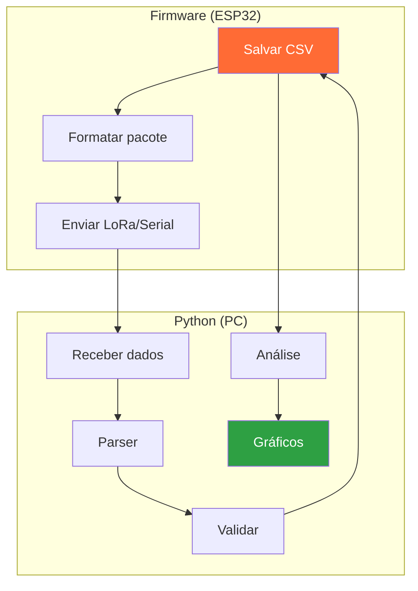

# Trilha Python

Python é a linguagem padrão do setor para análise de dados, simulação e ferramentas auxiliares. Tanto o Flight Computer quanto o satélite Helike usam Python extensivamente.

## O que você vai aprender

- Ler e processar dados de telemetria (CSV, JSON, serial)
- Implementar parsers e validadores de pacotes
- Analisar séries temporais com numpy/scipy
- Gerar gráficos e relatórios
- Simular sistemas físicos

## Pré-requisitos

- Python 3.10+ instalado
- VS Code (ou editor equivalente)
- Conhecimento básico de terminal

## Fluxo de Processamento de Dados


## Pipeline de Telemetria



---

## 1. Fundamentos para telemetria

### 1.1 Leitura de arquivos CSV

Dados de telemetria geralmente são registrados em CSV. É o formato usado tanto nos testes de bancada do Helike quanto nos logs de voo do Flight Computer.

```python
import csv

with open("telemetria.csv") as f:
    reader = csv.DictReader(f)
    for row in reader:
        print(row["altitude_m"], row["temperatura_C"])
```

Exemplo real - O Flight Computer loga sensores em CSV com colunas como `timestamp_ms, altitude_m, ax, ay, az, pressao_hPa`.

### 1.2 Parsing de pacotes serial

Dados vindos da serial do Arduino/ESP32 costumam vir em formato textual delimitado:

```
# Formato típico: #2024.1;125.3;9.81;0.01;0.02#
```

```python
def parse_packet(line: str) -> dict | None:
    if not line.startswith("#") or not line.endswith("#"):
        return None
    parts = line.strip("#").split(";")
    if len(parts) != 5:
        return None
    return {
        "timestamp_ms": float(parts[0]),
        "altitude_m": float(parts[1]),
        "ax": float(parts[2]),
        "ay": float(parts[3]),
        "az": float(parts[4]),
    }
```

No Helike - Os testes de integração (v3) enviam pacotes de 15 campos pela serial para validação.

### 1.3 Validação de dados

Sensores podem falhar. Dados inválidos precisam ser rejeitados antes do processamento.

```python
def validate_sensor_data(data: dict) -> bool:
    altitude = data.get("altitude_m")
    if altitude is None or altitude < -100 or altitude > 10000:
        return False
    ax, ay, az = data.get("ax", 0), data.get("ay", 0), data.get("az", 0)
    g = (ax2 + ay2 + az2)  0.5
    if g < 8.0 or g > 11.0:
        return False
    return True
```

Verifique também por NaN, valores negativos impossíveis e range físico de cada sensor.

---

## 2. Análise de séries temporais

### 2.1 Estatísticas básicas

```python
import csv

altitudes = []
with open("telemetria.csv") as f:
    for row in csv.DictReader(f):
        altitudes.append(float(row["altitude_m"]))

print(f"Media: {sum(altitudes)/len(altitudes):.2f} m")
print(f"Max:   {max(altitudes):.2f} m")
print(f"Min:   {min(altitudes):.2f} m")
```

### 2.2 Detecção de apogeu

O Flight Computer detecta apogeu (ponto mais alto do voo) para disparar o paraquedas. É uma lógica simples que você pode implementar:

```python
def detect_apogee(altitudes: list, window: int = 3) -> int:
    for i in range(window, len(altitudes) - window):
        before = altitudes[i - window : i]
        after = altitudes[i : i + window]
        if max(before) < altitudes[i] > max(after):
            return i
    return -1
```

No Flight Computer - A detecção real usa velocidade vertical (Vz) com filtro EMA, mas a lógica conceitual é a mesma.

### 2.3 Filtro EMA (Exponential Moving Average)

Usado no Helike para suavizar leituras de altitude e calcular Vz:

```python
def ema_filter(values: list, alpha: float = 0.3) -> list:
    result = [values[0]]
    for v in values[1:]:
        result.append(alpha  v + (1 - alpha)  result[-1])
    return result
```

---

## 3. Visualização com matplotlib

```python
import matplotlib.pyplot as plt
import csv

times, alts = [], []
with open("telemetria.csv") as f:
    for row in csv.DictReader(f):
        times.append(float(row["timestamp_ms"]) / 1000)
        alts.append(float(row["altitude_m"]))

plt.plot(times, alts)
plt.xlabel("Tempo (s)")
plt.ylabel("Altitude (m)")
plt.title("Perfil de Voo")
plt.grid(True)
plt.savefig("perfil_voo.png")
```

No Helike - A simulação da asa SRAB gera gráficos de altitude, velocidade e ângulo de cone automaticamente.

---

## 4. Numpy e Scipy (para processamento avançado)

```python
import numpy as np
from scipy import signal

# Carregar dados
data = np.genfromtxt("telemetria.csv", delimiter=",", skip_header=1)
altitudes = data[:, 1]

# Filtro passa-baixa
b, a = signal.butter(4, 0.1)
altitudes_filtradas = signal.filtfilt(b, a, altitudes)

# Estatisticas
print(f"Media:  {np.mean(altitudes):.2f}")
print(f"Std:    {np.std(altitudes):.2f}")
print(f"Max:    {np.max(altitudes):.2f}")
```

No Helike - A simulação da asa SRAB usa scipy para integrar EDOs (solve_ivp) e otimizar parâmetros.

---

## 5. Exercícios práticos

### Nível 1 - Leitura e estatísticas

1. Dado um CSV de telemetria (timestamp, altitude, ax, ay, az), calcule:
   - Altitude máxima, mínima e média
   - Número total de amostras
   - Duração total do registro em segundos

2. Salve o resumo em um arquivo `.txt`.

### Nível 2 - Parser e validação

1. Crie um parser que receba linhas no formato `#t;alt;ax;ay;az#` e retorne um dicionário.
2. Adicione validação: rejeite valores fora do range físico.
3. Conte e exiba estatísticas de pacotes válidos vs inválidos.

### Nível 3 - Análise de série temporal

1. Detecte o apogeu em uma série de altitude.
2. Aplique um filtro EMA e compare o resultado com os dados brutos (gráfico sobreposto).
3. Calcule a velocidade vertical (Vz) por diferença finita.

### Nível 4 - Conexão com projetos reais

1. Leia um arquivo CSV gerado pelo Flight Computer (Helike ou FC) e reproduza o perfil de voo.
2. Identifique as fases do voo (ascensão, queda, pouso) com base na altitude e Vz.

---

## Conexão com os projetos reais

| Conceito | Projeto | Onde é usado |
|---|---|---|
| Leitura de CSV | Flight Computer | Logs de voo pós-missão (22 campos) |
| Parsing serial | Helike / FC | Validação de dados em testes de bancada |
| Filtro EMA | Helike | Cálculo de Vz no firmware (alpha=0.4) |
| Detecção de apogeu | Flight Computer | Disparo do paraquedas (FSM) |
| numpy/scipy | Helike | Simulação aerodinâmica da asa SRAB |
| matplotlib | Ambos | Relatórios e análises pós-voo |
| Validação de dados | Ambos | Rejeição de NaN, ranges físicos |
| Checksum | Flight Computer | Verificação de integridade do pacote |

### Exemplo real: Análise de voo do Flight Computer

```python
import csv
import matplotlib.pyplot as plt

# Formato real do FC: 22 campos CSV
# TEAM_ID,millis,count,altp,temp,umi,p,gx,gy,gz,ax,ay,az,vz,maxAltitude,state,alt,lat,lon,sat,parachute,rssi

def analyze_flight_data(filename):
    timestamps, altitudes, vz_data = [], [], []
    
    with open(filename) as f:
        reader = csv.DictReader(f)
        for row in reader:
            timestamps.append(int(row['millis']) / 1000)  # ms → s
            altitudes.append(float(row['altp']))  # altitude barométrica
            vz_data.append(float(row['vz']))  # velocidade vertical
    
    # Encontrar apogeu (máxima altitude)
    apogee_idx = altitudes.index(max(altitudes))
    apogee_time = timestamps[apogee_idx]
    apogee_alt = altitudes[apogee_idx]
    
    # Plotar perfil de voo
    fig, (ax1, ax2) = plt.subplots(2, 1, figsize=(10, 8))
    
    ax1.plot(timestamps, altitudes, 'b-', label='Altitude')
    ax1.axvline(x=apogee_time, color='r', linestyle='--', label=f'Apogeu: {apogee_alt:.1f}m')
    ax1.set_xlabel('Tempo (s)')
    ax1.set_ylabel('Altitude (m)')
    ax1.set_title('Perfil de Voo - Flight Computer')
    ax1.legend()
    ax1.grid(True)
    
    ax2.plot(timestamps, vz_data, 'g-', label='Vz')
    ax2.axhline(y=0, color='k', linestyle='-', alpha=0.3)
    ax2.axvline(x=apogee_time, color='r', linestyle='--', label='Apogeu')
    ax2.set_xlabel('Tempo (s)')
    ax2.set_ylabel('Velocidade Vertical (m/s)')
    ax2.set_title('Velocidade Vertical')
    ax2.legend()
    ax2.grid(True)
    
    plt.tight_layout()
    plt.savefig('perfil_voo_fc.png')
    print(f"Apogeu: {apogee_alt:.1f}m em t={apogee_time:.1f}s")
```

### Exemplo real: Parser do formato Helike

```python
# Formato Helike: 18 campos + terminador '#'
# TEAM_ID,millis,count,altp,temp,umi,p,gp,gr,gy,ap,ar,ay,alt,lat,lon,sat,rssi#

def parse_helike_packet(line):
    """Parse pacote do satélite Helike"""
    if not line.endswith('#'):
        return None  # Pacote truncado/corrompido
    
    line = line.rstrip('#')
    fields = line.split(',')
    
    if len(fields) != 18:
        return None  # Número inválido de campos
    
    try:
        return {
            'team_id': int(fields[0]),
            'millis': int(fields[1]),
            'count': int(fields[2]),
            'altp': float(fields[3]),    # altitude barométrica
            'temp': float(fields[4]),    # temperatura
            'umidity': float(fields[5]), # umidade (NAN se BMP280)
            'pressure': float(fields[6]),# pressão hPa
            'gyro_x': float(fields[7]),  # giroscópio X (rad/s)
            'gyro_y': float(fields[8]),  # giroscópio Y
            'gyro_z': float(fields[9]),  # giroscópio Z
            'accel_x': float(fields[10]),# acelerômetro X (m/s²)
            'accel_y': float(fields[11]),# acelerômetro Y
            'accel_z': float(fields[12]),# acelerômetro Z
            'gps_alt': float(fields[13]),# altitude GPS
            'lat': float(fields[14]),    # latitude
            'lon': float(fields[15]),    # longitude
            'sat': int(fields[16]),      # satélites GPS
            'rssi': float(fields[17])    # potência do sinal
        }
    except (ValueError, IndexError):
        return None
```

## Entregas relacionadas

- [Semana 1](../semanas/semana-01.md): Leitura de CSV + estatísticas
- [Semana 2](../semanas/semana-02.md): Parser + validação
- [Semana 5](../semanas/semana-05.md): Integração Arduino ↔ Python

## Critérios de aceite

- Código executa sem erros
- Output legível e documentado
- README com instruções de execução
- Código no repositório pessoal (branch `nome-sobrenome`)
