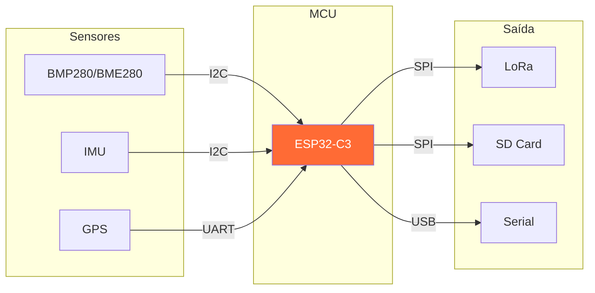
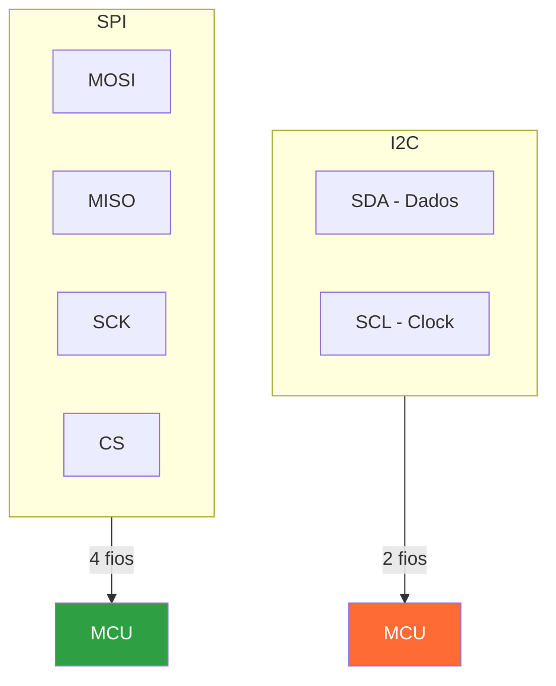

# Trilha Sensores e Protocolos

Esta trilha cobre os sensores e protocolos de comunicação usados nos projetos da Serra Rocketry.

## O que você vai aprender

- Protocolos I2C e SPI
- Sensores barométricos (BMP280, BME280, BMP585)
- IMUs (MPU6050, ICM-20602, LSM6DS3)
- GPS (NEO-6M, NEO-8M)
- LoRa (RFM95W)
- Integração de múltiplos sensores

## Pré-requisitos

- Trilha Arduino IDE concluída
- Conceitos básicos de eletrônica (tensão, corrente, pull-up)

## Fluxo de Dados nos Projetos



## Protocolos de Comunicação



---

## 1. Protocolos de comunicação

### 1.1 I2C (Inter-Integrated Circuit)

O protocolo mais comum para sensores. Usa apenas 2 fios (SDA + SCL) e suporta múltiplos dispositivos com endereços diferentes.

Características:
- Fios: SDA (dados) + SCL (clock)
- Endereços: 7 bits (0x03 a 0x77 típico)
- Velocidade: 100 kHz (Standard), 400 kHz (Fast)
- Pull-ups: Necessários em SDA e SCL (geralmente 10kΩ a 3.3V)

Endereços I2C nos projetos:

| Dispositivo | Endereço | Projeto |
|-------------|----------|---------|
| BMP280 | 0x76 ou 0x77 | Flight Computer (fallback) |
| BMP585 | 0x7E | Flight Computer v2 |
| BME280 | 0x76 | Helike |
| ICM-20602 | 0x69 | Helike |
| MPU6050 | 0x68 | Flight Computer v1 |
| LSM6DS3 | 0x6B | Flight Computer v2 |

Scan I2C - como descobrir dispositivos:

```cpp
#include <Wire.h>

void scanI2C() {
    Serial.println("Scanning I2C...");
    for (byte addr = 1; addr < 127; addr++) {
        Wire.beginTransmission(addr);
        if (Wire.endTransmission() == 0) {
            Serial.print("Device at 0x");
            Serial.println(addr, HEX);
        }
    }
}
```

### 1.2 SPI (Serial Peripheral Interface)

Protocolo mais rápido, usado para LoRa, SD card e alguns sensores.

Características:
- Fios: MOSI (master→slave), MISO (slave→master), SCK (clock), CS (chip select)
- Velocidade: Até 80 MHz (ESP32)
- Full-duplex: Envia e recebe simultaneamente
- CS por dispositivo: Cada slave tem seu pino CS

SPI nos projetos:

| Dispositivo | MOSI | MISO | SCK | CS | Projeto |
|-------------|------|------|-----|-----|---------|
| RFM95W LoRa | GPIO6 | GPIO5 | GPIO4 | GPIO7 | Helike |
| SD Card | GPIO6 | GPIO5 | GPIO4 | GPIO10 | Helike |
| RFM95W LoRa | GPIO11 | GPIO13 | GPIO12 | GPIO10 | FC |

Atenção: Helike e FC compartilham SPI entre LoRa e SD Card!

---

## 2. Sensores barométricos

### 2.1 BMP280 / BME280

| Parâmetro | BMP280 | BME280 |
|-----------|--------|--------|
| Pressão | 300-1100 hPa | 300-1100 hPa |
| Temperatura | -40 a +85°C | -40 a +85°C |
| Umidade | - | 0-100% RH |
| Interface | I2C (0x76/0x77) | I2C (0x76/0x77) |
| Precisão | ±1 hPa | ±1 hPa |

Leitura básica:

```cpp
#include <Wire.h>
#include <Adafruit_BMP280.h>

Adafruit_BMP280 bmp;

void setup() {
    Wire.begin(8, 9); // SDA=GPIO8, SCL=GPIO9 (Helike)
    if (!bmp.begin(0x76)) {
        Serial.println("BMP280 not found!");
        while (1);
    }
}

void loop() {
    float pressure = bmp.readPressure() / 100.0F; // hPa
    float temperature = bmp.readTemperature();      // °C
    float altitude = bmp.readAltitude(1013.25);    // metros (QNH=1013.25)
    
    Serial.print("#");
    Serial.print(millis());
    Serial.print(";");
    Serial.print(altitude);
    Serial.print(";");
    Serial.print(temperature);
    Serial.println("#");
    
    delay(100); // 10 Hz
}
```

### 2.2 BMP585 (Flight Computer v2)

Barômetro de alta precisão usado no Flight Computer v2.

Especificações:
- Precisão: ±0.06 hPa (relativa), ±0.5 hPa (absoluta)
- Range: 300-1250 hPa
- Interface: I2C (endereço configurável, padrão 0x76/0x77)
- Taxa: Até 200 Hz

Fallback: Se BMP585 não for encontrado, o firmware usa BMP280.

---

## 3. IMUs (Unidades de Medição Inercial)

### 3.1 MPU6050 (Flight Computer v1)

IMU de 6 eixos (acelerômetro + giroscópio).

| Parâmetro | Acelerômetro | Giroscópio |
|-----------|--------------|------------|
| Range | ±2, ±4, ±8, ±16g | ±250, ±500, ±1000, ±2000°/s |
| Resolução | 16-bit | 16-bit |
| Interface | I2C (0x68) | I2C (0x68) |

### 3.2 ICM-20602 (Helike)

IMU de 6 eixos de alta performance.

| Parâmetro | Acelerômetro | Giroscópio |
|-----------|--------------|------------|
| Range | ±4, ±8, ±16g | ±500, ±1000, ±2000°/s |
| Sensitivity | 4096 LSB/g | 65.5 LSB/°/s |
| Interface | I2C (0x69) | I2C (0x69) |

Leitura ICM-20602:

```cpp
#include <Wire.h>

#define ICM20602_ADDR 0x69

void readICM20602() {
    Wire.beginTransmission(ICM20602_ADDR);
    Wire.write(0x3B); // Registrador inicial (ACCEL_XOUT_H)
    Wire.endTransmission(false);
    Wire.requestFrom(ICM20602_ADDR, 14); // 6 accel + 6 gyro + 2 temp
    
    int16_t ax = Wire.read() << 8 | Wire.read();
    int16_t ay = Wire.read() << 8 | Wire.read();
    int16_t az = Wire.read() << 8 | Wire.read();
    Wire.read(); Wire.read(); // temp (não usado)
    int16_t gx = Wire.read() << 8 | Wire.read();
    int16_t gy = Wire.read() << 8 | Wire.read();
    int16_t gz = Wire.read() << 8 | Wire.read();
    
    // Converter para unidades físicas
    float accel_x = ax * 16.0 / 32768.0; // ±16g
    float accel_y = ay * 16.0 / 32768.0;
    float accel_z = az * 16.0 / 32768.0;
    float gyro_x = gx * 2000.0 / 32768.0; // ±2000°/s
    float gyro_y = gy * 2000.0 / 32768.0;
    float gyro_z = gz * 2000.0 / 32768.0;
}
```

### 3.3 LSM6DS3 (Flight Computer v2)

IMU de 6 eixos de baixo ruído.

| Parâmetro | Acelerômetro | Giroscópio |
|-----------|--------------|------------|
| Range | ±2, ±4, ±8, ±16g | ±125, ±250, ±500, ±1000, ±2000°/s |
| Interface | I2C (0x6B) | I2C (0x6B) |

---

## 4. GPS

### 4.1 NEO-6M / NEO-8M

Módulos GPS que fornecem posição, altitude e hora.

| Parâmetro | NEO-6M | NEO-8M |
|-----------|--------|--------|
| Sensibilidade | -161 dBm | -167 dBm |
| Aquisição | Cold: 29s | Cold: 26s |
| Precisão | ±2.5m | ±2.5m |
| Taxa | Até 5 Hz | Até 10 Hz |
| Protocolo | NMEA 0183 | NMEA 0183 |
| Interface | UART (9600 baud) | UART (9600 baud) |

Uso com TinyGPS++:

```cpp
#include <TinyGPSPlus.h>

TinyGPSPlus gps;

void readGPS() {
    while (Serial1.available()) {
        gps.encode(Serial1.read());
    }
    
    if (gps.location.isValid()) {
        Serial.print("Lat: ");
        Serial.print(gps.location.lat(), 6);
        Serial.print(" Lon: ");
        Serial.print(gps.location.lng(), 6);
        Serial.print(" Alt: ");
        Serial.print(gps.altitude.meters());
        Serial.print(" Sats: ");
        Serial.println(gps.satellites.value());
    }
}
```

---

## 5. LoRa (RFM95W)

### 5.1 Configuração

O LoRa é usado para transmissão de telemetria de longo alcance.

| Parâmetro | Valor |
|-----------|-------|
| Frequência | 915 MHz (Brasil/Américas) |
| Sync Word | 0xF3 |
| Spreading Factor | 7 |
| Bandwidth | 125 kHz |
| Coding Rate | 4/5 |
| TX Power | +17 dBm (FC) / +20 dBm (Helike) |
| CRC | Habilitado |
| Alcance | ~4 km (campo aberto) |

Envio e recepção:

```cpp
#include <SPI.h>
#include <LoRa.h>

#define SS_PIN 7
#define RST_PIN 1
#define DIO0_PIN 2

void setup() {
    LoRa.setPins(SS_PIN, RST_PIN, DIO0_PIN);
    if (!LoRa.begin(915E6)) {
        Serial.println("LoRa init failed!");
        while (1);
    }
    LoRa.setSyncWord(0xF3);
}

void sendPacket(String packet) {
    LoRa.beginPacket();
    LoRa.print(packet);
    LoRa.endPacket();
}

String receivePacket() {
    int packetSize = LoRa.parsePacket();
    if (packetSize) {
        String received = "";
        while (LoRa.available()) {
            received += (char)LoRa.read();
        }
        return received;
    }
    return "";
}
```

---

## 6. Integração de múltiplos sensores

### 6.1 Ordem de inicialização

A ordem importa! No Helike:

```cpp
void setup() {
    // 1. Serial primeiro (debug)
    Serial.begin(115200);
    
    // 2. I2C (sensores)
    Wire.begin(I2C_SDA, I2C_SCL);
    
    // 3. Sensores I2C
    bme.begin(BME280_ADDR);
    icm.begin(Wire, ICM20602_ADDR);
    
    // 4. SPI (LoRa + SD)
    SPI.begin(SCK_PIN, MISO_PIN, MOSI_PIN);
    LoRa.begin(915E6);
    SD.begin(SD_CS);
    
    // 5. UART (GPS)
    Serial1.begin(9600, SERIAL_8N1, RX_GPS, TX_GPS);
}
```

### 6.2 Exemplo completo - Leitura de todos os sensores

```cpp
void readAllSensors() {
    // Barômetro
    float altitude = bme.readAltitude(1013.25);
    float temperature = bme.readTemperature();
    float pressure = bme.readPressure() / 100.0F;
    
    // IMU
    sensors_event_t a, g;
    icm.getEvent(&a, &g);
    float ax = a.acceleration.x;
    float ay = a.acceleration.y;
    float az = a.acceleration.z;
    
    // GPS
    while (Serial1.available()) {
        gps.encode(Serial1.read());
    }
    float lat = gps.location.lat();
    float lon = gps.location.lng();
    float gps_alt = gps.altitude.meters();
    
    // Montar pacote
    char packet[200];
    snprintf(packet, sizeof(packet),
        "#%lu;%.2f;%.2f;%.2f;%.2f;%.2f;%.2f;%.6f;%.6f;%.2f#",
        millis(), altitude, temperature, pressure,
        ax, ay, az, lat, lon, gps_alt);
    
    Serial.println(packet);
}
```

---

## 7. Exercícios práticos

### Nível 1 - I2C básico

1. Faça scan I2C e liste todos os dispositivos encontrados
2. Leia BMP280 e imprima altitude, temperatura e pressão
3. Leia acelerômetro (MPU6050 ou ICM-20602) e imprima valores

### Nível 2 - SPI e LoRa

1. Configure LoRa e envie um pacote a cada segundo
2. Receba pacotes e imprima na serial
3. Adicione RSSI (potência do sinal recebido)

### Nível 3 - Integração

1. Leia barômetro + IMU + GPS simultaneamente
2. Monte um pacote CSV com todos os campos
3. Transmita via LoRa

### Nível 4 - Projeto real

1. Estude o pinout do Helike em `docs/hardware.md`
2. Implemente a leitura de todos os sensores
3. Valide os dados (NaN, ranges físicos)
4. Documente o formato do pacote

---

## Conexão com os projetos reais

| Conceito | Projeto | Onde é usado |
|---|---|---|
| I2C (SDA/SCL) | Ambos | Todos os sensores |
| SPI (MOSI/MISO/SCK) | Ambos | LoRa + SD Card |
| UART (GPS) | Ambos | NEO-8M GPS |
| BMP585 | Flight Computer | Barômetro principal |
| BME280 | Helike | Barômetro + umidade |
| ICM-20602 | Helike | IMU 6 eixos |
| LSM6DS3 | Flight Computer | IMU 6 eixos |
| RFM95W LoRa | Ambos | Telemetria 915 MHz |
| TinyGPS++ | Ambos | Parser NMEA |

## Entregas relacionadas

- Semana 3: Leitura de sensor via I2C
- Semana 5: Integração Arduino ↔ Python
- Semana 7: Contexto dos projetos reais

## Referências

- [I2C Specification](https://assets.nexperia.com/documents/user-manual/UM10204.pdf)
- [SPI Protocol Overview](https://learn.sparkfun.com/tutorials/serial-peripheral-interface-spi/all)
- [Helike README](https://github.com/ViniciusCMB/satellite/blob/main/README.md)
- [Flight Computer hardware.md](https://github.com/ViniciusCMB/flight-computer/blob/main/docs/hardware.md)
